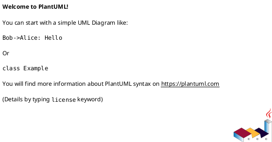
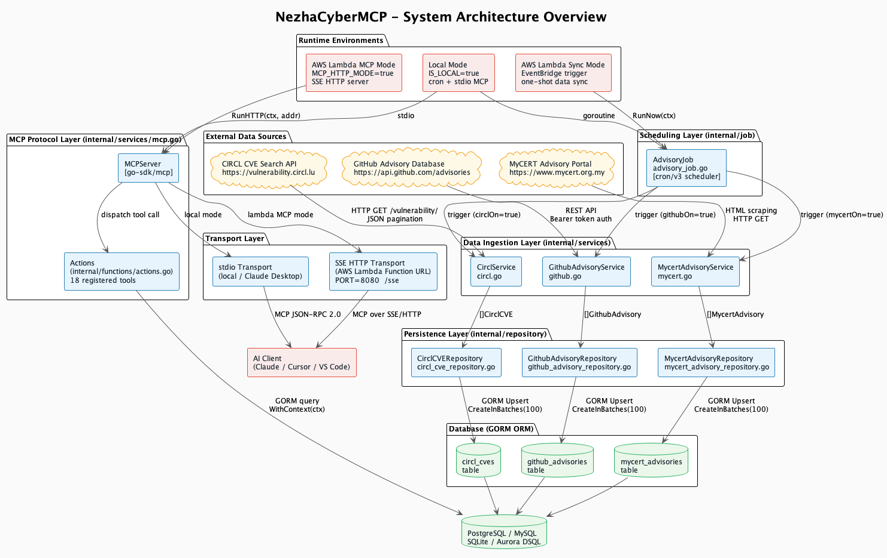
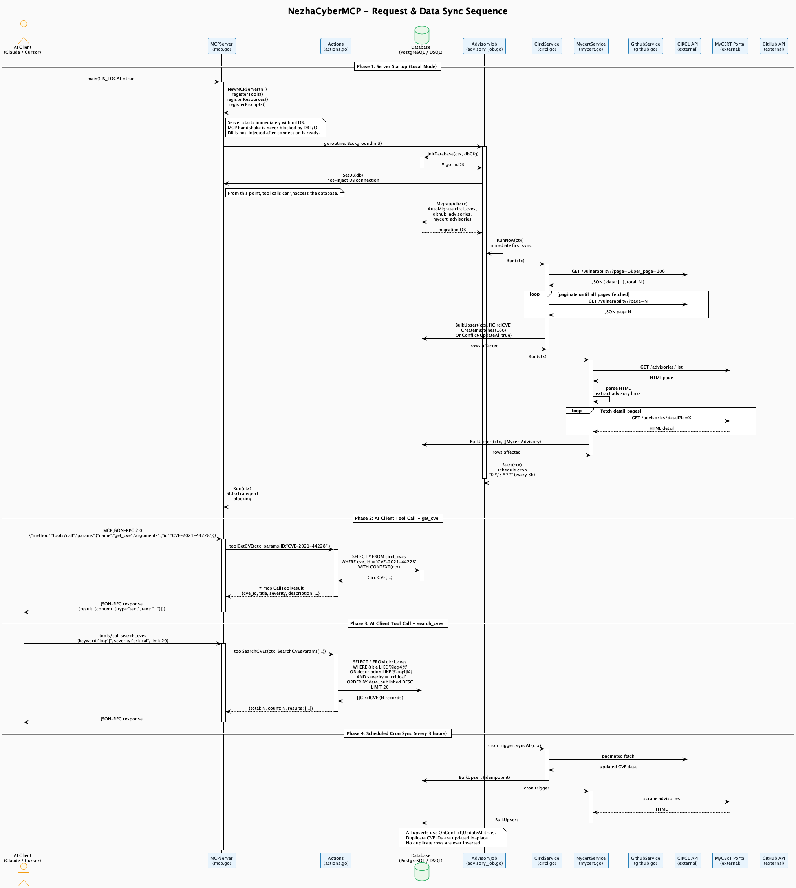

<div align="center">


# NezhaCyberMCP

**A production-grade Model Context Protocol (MCP) server for CVE vulnerability intelligence.**

Aggregate, store, and query security advisories from CIRCL, MyCERT, and GitHub Advisory Database — served directly to your AI assistant via MCP JSON-RPC 2.0.

[](https://go.dev)
[](https://github.com/modelcontextprotocol/go-sdk)
[](./LICENSE)
[](https://aws.amazon.com/lambda/)
[](https://gorm.io)

[English](#) | [中文](./README_zh.md)

</div>

---

## Table of Contents

- [Overview](#overview)
- [System Architecture](#system-architecture)
- [Data Sources](#data-sources)
- [MCP Tools Reference](#mcp-tools-reference)
- [Data Models](#data-models)
- [Security Considerations](#security-considerations)
- [Runtime Environments](#runtime-environments)
- [Quick Start](#quick-start)
- [Configuration Reference](#configuration-reference)
- [Build & Deployment](#build--deployment)
- [Database Support](#database-support)
- [Rendered Diagrams](#rendered-diagrams)
- [Project Structure](#project-structure)
- [License](#license)

---

## Overview

NezhaCyberMCP is a Go-based MCP server that bridges AI assistants (Claude, Cursor, VS Code Copilot) with a continuously updated CVE vulnerability database. It operates in three distinct runtime modes:

| Mode            | Trigger              | Transport              | Use Case                          |
| --------------- | -------------------- | ---------------------- | --------------------------------- |
| **Local**       | `IS_LOCAL=true`      | stdio (JSON-RPC 2.0)   | Claude Desktop, local development |
| **Lambda Sync** | EventBridge cron     | —                      | Scheduled data ingestion only     |
| **Lambda MCP**  | `MCP_HTTP_MODE=true` | SSE over HTTP (`/sse`) | Cloud-hosted MCP endpoint         |

The server exposes **18 registered MCP tools** covering CVE lookup, multi-dimensional search, CPE matching, severity filtering, trend analysis, and vendor/product statistics.

---

## System Architecture

The system is organized into six distinct layers. Each layer has a single, well-defined responsibility and communicates only with adjacent layers.

```
+---------------------------+
|       AI Client           |  Claude / Cursor / VS Code
|  (MCP JSON-RPC 2.0)       |
+---------------------------+
            |
            v
+---------------------------+
|     Transport Layer       |  stdio (local) | SSE HTTP (Lambda)
+---------------------------+
            |
            v
+---------------------------+
|    MCP Protocol Layer     |  MCPServer + 18 Tools (mcp.go)
|    Actions Dispatcher     |  actions.go — query routing
+---------------------------+
            |
            v
+---------------------------+
|    Persistence Layer      |  GORM repositories (3 tables)
|    (Repository Pattern)   |  Upsert, batch write, query
+---------------------------+
            |
            v
+---------------------------+
|       Database            |  PostgreSQL / MySQL / SQLite
|                           |  Amazon Aurora DSQL (AWS)
+---------------------------+
            ^
            |
+---------------------------+
|   Data Ingestion Layer    |  CirclService / GithubService
|   + Scheduling Layer      |  MycertService + cron/v3
+---------------------------+
            ^
            |
+---------------------------+
|   External Data Sources   |  CIRCL API / GitHub API
|                           |  MyCERT Portal (HTML scraping)
+---------------------------+
```

### Architecture Diagram (PlantUML)

> The full PlantUML source is available at [`docs/en/flow.puml`](./docs/en/flow.puml).
> Render it with [PlantUML Online](https://www.plantuml.com/plantuml/uml/) or the VS Code PlantUML extension.



### Sequence Diagram (PlantUML)

> The full request lifecycle and data sync sequence is at [`docs/en/sequence.puml`](./docs/en/sequence.puml).

**Key design decision — non-blocking startup:**

The `MCPServer` is constructed with a `nil` database connection and starts immediately. The MCP protocol handshake (`initialize` → `initialized`) completes before any database I/O begins. The database connection is established in a background goroutine and hot-injected via `SetDB()` once ready. This ensures the AI client never experiences a connection timeout during server startup.

```
main()
  |
  +-- NewMCPServer(nil)          <-- starts immediately, no DB needed
  |     registerTools()
  |     registerResources()
  |     registerPrompts()
  |
  +-- goroutine: BackgroundInit()
  |     InitDatabase(ctx, cfg)
  |     mcpServer.SetDB(db)      <-- hot-inject when ready
  |     MigrateAll(ctx)
  |     RunNow(ctx)              <-- immediate first sync
  |     advisoryJob.Start(ctx)   <-- schedule cron
  |
  +-- mcpServer.Run(ctx)         <-- blocking stdio loop
```

---

## Data Sources

### 1. CIRCL CVE Search API

- **Endpoint:** `https://vulnerability.circl.lu/api/vulnerability/`
- **Protocol:** HTTP REST, JSON pagination (`page`, `per_page=100`)
- **Authentication:** None required (public API)
- **Data:** Full CVE records including CVSS scores, CWE IDs, affected packages, references
- **Sync frequency:** Every 3 hours (configurable via cron expression)
- **Rate limiting:** 500ms between requests (`RateLimit` config field)
- **Retry policy:** Up to 5 retries with 2-second exponential backoff

**Pagination algorithm:**

```
page := 1
for {
    resp = GET /vulnerability/?page={page}&per_page=100
    if len(resp.Data) == 0 { break }
    BulkUpsert(resp.Data)
    page++
}
```

### 2. GitHub Advisory Database

- **Endpoint:** `https://api.github.com/advisories`
- **Protocol:** GitHub REST API v3
- **Authentication:** Bearer token (`GITHUB_TOKEN` environment variable)
- **Data:** GHSA records with CVE cross-references, severity, affected packages (ecosystem-aware)
- **Toggle:** Controlled by `IsGithubAdvisoryTurnOn` constant (currently `false`)

### 3. MyCERT Advisory Portal

- **Source:** `https://www.mycert.org.my`
- **Protocol:** HTML scraping via `golang.org/x/net/html`
- **Authentication:** None required (public portal)
- **Data:** Malaysian CERT security advisories with full-text content
- **Detail fetch:** Enabled when `FetchDetail=true` (fetches individual advisory pages)
- **Toggle:** Controlled by `IsMycertAdvisoryTurnOn` constant (currently `true`)

---

## MCP Tools Reference

All tools communicate via MCP JSON-RPC 2.0. Tool inputs are validated against JSON Schema. All responses are structured JSON.

### Query Tools

| Tool                 | Description                       | Key Parameters                                                                   |
| -------------------- | --------------------------------- | -------------------------------------------------------------------------------- |
| `get_cve`            | Fetch a single CVE record by ID   | `id: string` (e.g. `CVE-2021-44228`)                                             |
| `search_cves`        | Multi-dimensional CVE search      | `keyword`, `vendor`, `product`, `cwe`, `date_from`, `date_to`, `status`, `limit` |
| `search_by_cpe`      | Search CVEs by CPE 2.3 string     | `cpe_string` (full CPE or `vendor:product` fragment)                             |
| `bulk_get`           | Batch fetch up to 50 CVEs         | `ids: []string`                                                                  |
| `filter_by_severity` | Filter by severity level          | `severities: []string`, `date_from`, `date_to`, `limit`                          |
| `get_cwe`            | Extract CWE IDs from a CVE        | `id: string`                                                                     |
| `get_references`     | Extract reference URLs from a CVE | `id: string`                                                                     |
| `related_cves`       | Find CVEs sharing assigner or CWE | `id: string`                                                                     |
| `whats_new`          | CVEs published after a given date | `since: string`, `min_severity: string`                                          |

### Analytics Tools

| Tool                    | Description             | Key Parameters                                                 |
| ----------------------- | ----------------------- | -------------------------------------------------------------- |
| `vuln_trends`           | CVE count over time     | `group_by: day\|week\|month\|severity`, `date_from`, `date_to` |
| `top_vendors`           | Vendors with most CVEs  | `date_from`, `date_to`, `limit`                                |
| `top_products`          | Products with most CVEs | `vendor`, `date_from`, `date_to`, `limit`                      |
| `severity_distribution` | Count by severity level | `date_from`, `date_to`, `vendor`                               |

### Asset Matching Tools

| Tool              | Description                           | Key Parameters                                                          |
| ----------------- | ------------------------------------- | ----------------------------------------------------------------------- |
| `match_inventory` | Match software inventory against CVEs | `packages: []string` (`vendor:product[:version]`), `cpe_list: []string` |

### Placeholder Tools (Not Yet Implemented)

These tools are registered and return a clear `not implemented` error. They are designed for future integration:

| Tool             | Planned Data Source                           |
| ---------------- | --------------------------------------------- |
| `get_kev_status` | CISA Known Exploited Vulnerabilities catalog  |
| `get_epss`       | EPSS (Exploit Prediction Scoring System) feed |
| `prioritize`     | CVSS + EPSS + KEV composite scoring           |
| `match_sbom`     | CycloneDX / SPDX SBOM parsing                 |

---

## Data Models

### `CirclCVE` — `circl_cves` table

Primary source of CVE data. Populated from the CIRCL Vulnerability-Lookup API.

| Column            | Type           | Description                                                        |
| ----------------- | -------------- | ------------------------------------------------------------------ |
| `cve_id`          | `VARCHAR` (PK) | CVE identifier (e.g. `CVE-2021-44228`)                             |
| `state`           | `VARCHAR`      | `PUBLISHED` \| `REJECTED` \| `RESERVED`                            |
| `assigner_org_id` | `VARCHAR`      | Assigning organization UUID                                        |
| `assigner_short`  | `VARCHAR`      | Short name (e.g. `apache`)                                         |
| `title`           | `TEXT`         | Vulnerability title                                                |
| `description`     | `TEXT`         | Full description                                                   |
| `severity`        | `VARCHAR`      | Normalized: `critical` \| `high` \| `medium` \| `low` \| `unknown` |
| `cwe_ids`         | `TEXT` (JSON)  | Array of CWE identifiers                                           |
| `affected`        | `TEXT` (JSON)  | Affected packages array                                            |
| `references`      | `TEXT` (JSON)  | Reference URLs array                                               |
| `date_published`  | `TIMESTAMP`    | First publication date (nullable)                                  |
| `date_updated`    | `TIMESTAMP`    | Last update date (nullable)                                        |
| `date_reserved`   | `TIMESTAMP`    | CVE ID reservation date (nullable)                                 |
| `scraped_at`      | `TIMESTAMP`    | Last ingestion timestamp (auto-updated)                            |

### `GithubAdvisory` — `github_advisories` table

| Column            | Type           | Description                               |
| ----------------- | -------------- | ----------------------------------------- |
| `ghsa_id`         | `VARCHAR` (PK) | GitHub Security Advisory ID               |
| `cve_id`          | `VARCHAR`      | Cross-referenced CVE ID (nullable)        |
| `summary`         | `VARCHAR`      | One-line summary                          |
| `description`     | `TEXT`         | Full description                          |
| `severity`        | `VARCHAR`      | `low` \| `medium` \| `high` \| `critical` |
| `type`            | `VARCHAR`      | `reviewed` \| `unreviewed` \| `malware`   |
| `vulnerabilities` | `TEXT` (JSON)  | Affected packages with ecosystem info     |
| `published_at`    | `TIMESTAMP`    | Publication date (nullable)               |
| `withdrawn_at`    | `TIMESTAMP`    | Withdrawal date (nullable)                |

### `MycertAdvisory` — `mycert_advisories` table

| Column         | Type           | Description                                  |
| -------------- | -------------- | -------------------------------------------- |
| `advisory_id`  | `VARCHAR` (PK) | MyCERT advisory ID (from URL parameter)      |
| `title`        | `TEXT`         | Advisory title                               |
| `category`     | `VARCHAR`      | Advisory category (e.g. `Advisory`, `Alert`) |
| `summary`      | `TEXT`         | Advisory summary                             |
| `detail_url`   | `VARCHAR`      | Full URL to advisory detail page             |
| `full_content` | `TEXT`         | Full page content (when `FetchDetail=true`)  |
| `published_at` | `TIMESTAMP`    | Publication date (nullable)                  |
| `scraped_at`   | `TIMESTAMP`    | Last ingestion timestamp (auto-updated)      |

---

## Security Considerations

### Authentication & Authorization

**No credentials are hardcoded.** All sensitive values are read exclusively from environment variables:

| Secret                | Environment Variable    | Required                                |
| --------------------- | ----------------------- | --------------------------------------- |
| GitHub API token      | `GITHUB_TOKEN`          | Only when `IsGithubAdvisoryTurnOn=true` |
| Database password     | `DB_PASSWORD`           | Always                                  |
| AWS Access Key ID     | `AWS_ACCESS_KEY_ID`     | AWS environments only                   |
| AWS Secret Access Key | `AWS_SECRET_ACCESS_KEY` | AWS environments only                   |

**AWS credential validation** (`utilities/aws.go`): The `IsRunInAWS()` function validates that `AWS_ACCESS_KEY_ID` and `AWS_SECRET_ACCESS_KEY` are not empty and do not contain placeholder values (e.g. strings consisting of a single repeated character like `xxx`, or strings beginning with `multiple`). This prevents silent failures from misconfigured deployments.

**AWS Lambda IAM:** In Lambda runtime (`AWS_LAMBDA_RUNTIME_API` is set), credentials are automatically injected by the IAM execution role. No static credentials are needed or used.

### Data Protection

- **No PII stored:** The database contains only public CVE data from open sources. No user data, session tokens, or personal information is persisted.
- **Context propagation:** All database queries use `WithContext(ctx)`, ensuring that request cancellation and timeout signals propagate correctly to the database driver. This prevents goroutine leaks and runaway queries.
- **Idempotent writes:** All ingestion operations use `OnConflict{UpdateAll: true}` with `CreateInBatches(100)` wrapped in a database transaction. This guarantees atomicity and prevents partial writes.

### Input Validation

- MCP tool parameters are validated against JSON Schema by the `go-sdk/mcp` library before reaching `Actions`.
- SQL injection is prevented by GORM's parameterized query builder. Raw SQL is never constructed via string concatenation.
- CVE ID format is not validated at the application layer — the database primary key constraint enforces uniqueness.

### Transport Security

- **stdio mode:** Communication is over local process pipes. No network exposure.
- **SSE HTTP mode:** The server listens on `localhost:PORT`. In Lambda, AWS handles TLS termination at the Function URL layer. The internal HTTP server is never directly exposed to the internet.

### Logging

Structured logging via `utilities/logger.go`. Log levels: `DEBUG`, `INFO`, `WARN`, `ERROR`, `VERBOSE`. Sensitive values (credentials, tokens) are masked using `utilities.Mask()` before being written to logs. The `LOG_LEVEL` environment variable controls verbosity.

---

## Runtime Environments

### Local Mode

```
IS_LOCAL=true
```

Starts a long-running process with:

1. Background goroutine: DB init → migration → immediate sync → cron scheduler
2. Foreground: MCP stdio server (blocking)

The DB is hot-injected into the MCP server after connection is established. Tool calls made before DB is ready return a clear error message rather than panicking.

### AWS Lambda — Sync Mode (default)

Triggered by EventBridge scheduled rules. Executes one complete sync cycle (migrate + fetch all sources) and exits. No MCP server is started.

```
# EventBridge rule example
rate(3 hours)
```

### AWS Lambda — MCP HTTP Mode

```
MCP_HTTP_MODE=true
PORT=8080
```

Starts an SSE HTTP server. AWS Lambda Function URL proxies HTTPS requests to `localhost:8080`. The `/sse` endpoint serves the MCP SSE transport. No cron scheduler is started — data is written by the sync Lambda.

---

## Quick Start

### Prerequisites

- Go 1.26.1+
- A running PostgreSQL instance (or SQLite for local testing)
- `make` (optional, for convenience targets)

### 1. Clone and configure

```bash
git clone https://github.com/ctkqiang/NezhaCyberMCP.git
cd NezhaCyberMCP
cp .env.example .env   # edit with your database credentials
```

### 2. Configure `.env`

```dotenv
# Runtime mode
IS_LOCAL=true

# Database (PostgreSQL example)
DB_HOST=localhost
DB_PORT=5432
DB_USER=postgres
DB_PASSWORD=your_password
DB_NAME=nezha_cyber
DB_TIMEZONE=Asia/Shanghai

# Optional: GitHub Advisory sync
GITHUB_TOKEN=ghp_xxxxxxxxxxxx

# Logging
LOG_LEVEL=INFO
```

### 3. Build and run

```bash
make build
./advisory
```

Or run directly:

```bash
go run .
```

### 4. Inspect with MCP Inspector

```bash
make run
# Equivalent to: npx @modelcontextprotocol/inspector ./advisory
```

### 5. Configure Claude Desktop

Add to `~/Library/Application Support/Claude/claude_desktop_config.json`:

```json
{
  "mcpServers": {
    "nezha-cyber": {
      "command": "/absolute/path/to/advisory",
      "env": {
        "IS_LOCAL": "true",
        "DB_HOST": "localhost",
        "DB_PORT": "5432",
        "DB_USER": "postgres",
        "DB_PASSWORD": "your_password",
        "DB_NAME": "nezha_cyber"
      }
    }
  }
}
```

---

## Configuration Reference

### Environment Variables

| Variable                | Default          | Description                                                        |
| ----------------------- | ---------------- | ------------------------------------------------------------------ |
| `IS_LOCAL`              | `false`          | Set `true` to run in local mode (cron + stdio MCP)                 |
| `MCP_HTTP_MODE`         | `false`          | Set `true` to run SSE HTTP server (Lambda MCP mode)                |
| `IS_AWS`                | `false`          | Set `true` to use Amazon Aurora DSQL                               |
| `DB_HOST`               | —                | Database host                                                      |
| `DB_PORT`               | `5432`           | Database port                                                      |
| `DB_USER`               | —                | Database username                                                  |
| `DB_PASSWORD`           | —                | Database password                                                  |
| `DB_NAME`               | —                | Database name                                                      |
| `DB_TIMEZONE`           | `Asia/Shanghai`  | IANA timezone for cron scheduler                                   |
| `GITHUB_TOKEN`          | —                | GitHub Personal Access Token (for GitHub Advisory sync)            |
| `AWS_REGION`            | `ap-southeast-1` | AWS region (Aurora DSQL)                                           |
| `AWS_ACCESS_KEY_ID`     | —                | AWS access key (non-Lambda environments)                           |
| `AWS_SECRET_ACCESS_KEY` | —                | AWS secret key (non-Lambda environments)                           |
| `PORT`                  | `8080`           | HTTP port for SSE mode                                             |
| `LOG_LEVEL`             | `INFO`           | Log verbosity: `DEBUG` \| `INFO` \| `WARN` \| `ERROR` \| `VERBOSE` |

### Scraper Configuration (in `main.go`)

```go
scraperCfg := &services.AdvisoryScraperConfig{
    MaxPages:       0,              // 0 = fetch all pages
    RequestTimeout: 30 * time.Second,
    PerPage:        100,            // max items per API page
    RetryMax:       5,              // max retry attempts
    RetryBackoff:   2 * time.Second,
    Token:          getEnv("GITHUB_TOKEN", ""),
}

circlCfg := &services.CirclScraperConfig{
    RequestTimeout: 30 * time.Second,
    RetryMax:       5,
    RetryBackoff:   2 * time.Second,
    RateLimit:      500 * time.Millisecond, // delay between requests
}
```

### Data Source Toggles (in `main.go`)

```go
const (
    IsGithubAdvisoryTurnOn = false  // GitHub Advisory sync
    IsMycertAdvisoryTurnOn = true   // MyCERT advisory sync
    IsCirclCVETurnOn       = true   // CIRCL CVE sync
)
```

---

## Build & Deployment

### Local Binary

```bash
make build
# Output: ./advisory
```

### AWS Lambda — x86_64

```bash
make lambda
# Output: bootstrap.zip (ready for Lambda deployment)
```

### AWS Lambda — arm64 (Graviton2, lower cost)

```bash
make lambda-arm64
# Output: bootstrap-arm64.zip
```

### Run Tests

```bash
make test
# Equivalent to: go test ./test/... -v -count=1
```

### Lint

```bash
make lint
# Requires: golangci-lint
```

---

## Database Support

NezhaCyberMCP supports four database backends via GORM drivers:

| Database           | Driver                            | Notes                          |
| ------------------ | --------------------------------- | ------------------------------ |
| PostgreSQL         | `gorm.io/driver/postgres`         | Recommended for production     |
| MySQL              | `gorm.io/driver/mysql`            | Supported                      |
| SQLite             | `gorm.io/driver/sqlite`           | Suitable for local development |
| Amazon Aurora DSQL | `aws-sdk-go-v2/feature/dsql/auth` | AWS production, IAM auth       |

**Schema migration** is handled automatically by GORM `AutoMigrate` on every startup. Migrations are idempotent — running them multiple times is safe.

**Batch write strategy:**

```go
// All bulk writes use this pattern:
err := r.db.WithContext(ctx).Transaction(func(tx *gorm.DB) error {
    return tx.Clauses(clause.OnConflict{UpdateAll: true}).
        CreateInBatches(items, 100).Error
})
```

This ensures:

- Atomicity: all-or-nothing writes per batch
- Idempotency: existing records are updated, not duplicated
- Performance: 100-row batches reduce round-trip overhead

---

## Rendered Diagrams

The `out/` directory contains pre-rendered PNG exports of all PlantUML diagrams. These images are generated automatically from the `.puml` source files in `docs/` and are ready to embed in documentation, wikis, or presentations without requiring a local PlantUML installation.

### Directory Structure

```
out/
└── docs/
    ├── en/
    │   ├── flow/
    │   │   └── NezhaCyberMCP_Architecture.png   # English system architecture diagram
    │   └── sequence/
    │       └── NezhaCyberMCP_Sequence.png        # English request & data sync sequence diagram
    └── zh/
        ├── flow/
        │   └── NezhaCyberMCP_架构图.png           # Chinese system architecture diagram
        └── sequence/
            └── NezhaCyberMCP_时序图.png           # Chinese request & data sync sequence diagram
```

### File Descriptions

| File                                              | Source                  | Description                                                                                                                                                     |
| ------------------------------------------------- | ----------------------- | --------------------------------------------------------------------------------------------------------------------------------------------------------------- |
| `out/docs/en/flow/NezhaCyberMCP_Architecture.png` | `docs/en/flow.puml`     | Full six-layer system architecture: external data sources, ingestion services, scheduling, repositories, database, MCP protocol layer, transport, and AI client |
| `out/docs/en/sequence/NezhaCyberMCP_Sequence.png` | `docs/en/sequence.puml` | Four-phase sequence diagram: server startup with non-blocking DB hot-injection, `get_cve` tool call, `search_cves` tool call, and scheduled cron sync           |
| `out/docs/zh/flow/NezhaCyberMCP_架构图.png`       | `docs/zh/flow.puml`     | Chinese-language equivalent of the architecture diagram                                                                                                         |
| `out/docs/zh/sequence/NezhaCyberMCP_时序图.png`   | `docs/zh/sequence.puml` | Chinese-language equivalent of the sequence diagram                                                                                                             |

### Architecture Diagram



### Sequence Diagram



### Naming Convention

Output files follow the naming pattern defined by the `@startuml <DiagramName>` declaration at the top of each `.puml` source file:

- `@startuml NezhaCyberMCP_Architecture` → `NezhaCyberMCP_Architecture.png`
- `@startuml NezhaCyberMCP_Sequence` → `NezhaCyberMCP_Sequence.png`
- `@startuml NezhaCyberMCP_架构图` → `NezhaCyberMCP_架构图.png`
- `@startuml NezhaCyberMCP_时序图` → `NezhaCyberMCP_时序图.png`

### Regenerating the Diagrams

To regenerate all PNG files from the `.puml` sources, run PlantUML against the `docs/` directory with the output path set to `out/docs/`:

```bash
# Requires Java and PlantUML jar, or the plantuml CLI
plantuml -tpng -o ../../out/docs/en/flow/   docs/en/flow.puml
plantuml -tpng -o ../../out/docs/en/sequence/ docs/en/sequence.puml
plantuml -tpng -o ../../out/docs/zh/flow/   docs/zh/flow.puml
plantuml -tpng -o ../../out/docs/zh/sequence/ docs/zh/sequence.puml
```

Or use the VS Code PlantUML extension (`Alt+D` to preview, `Ctrl+Shift+P` → `PlantUML: Export Current File Diagrams`) and set the export directory to `out/`.

> **Note:** The `out/` directory is intentionally committed to the repository so that rendered diagrams are immediately viewable on GitHub without requiring any local tooling.

---

## Project Structure

```
NezhaCyberMCP/
├── main.go                          # Entry point, runtime mode selection
├── go.mod                           # Go module definition
├── Makefile                         # Build, test, lint, Lambda packaging
├── docs/
│   ├── en/
│   │   ├── flow.puml                # System architecture diagram source (English)
│   │   └── sequence.puml            # Request/sync sequence diagram source (English)
│   └── zh/
│       ├── flow.puml                # System architecture diagram source (Chinese)
│       └── sequence.puml            # Request/sync sequence diagram source (Chinese)
├── out/
│   └── docs/
│       ├── en/
│       │   ├── flow/
│       │   │   └── NezhaCyberMCP_Architecture.png   # Rendered architecture diagram (English)
│       │   └── sequence/
│       │       └── NezhaCyberMCP_Sequence.png        # Rendered sequence diagram (English)
│       └── zh/
│           ├── flow/
│           │   └── NezhaCyberMCP_架构图.png           # Rendered architecture diagram (Chinese)
│           └── sequence/
│               └── NezhaCyberMCP_时序图.png           # Rendered sequence diagram (Chinese)
├── internal/
│   ├── functions/
│   │   └── actions.go               # MCP tool implementations & DB query logic
│   ├── job/
│   │   └── advisory_job.go          # cron scheduler, migration, sync orchestration
│   ├── model/
│   │   ├── circl_cve.go             # CirclCVE GORM model
│   │   ├── github_advisory.go       # GithubAdvisory GORM model
│   │   └── mycert_advisory.go       # MycertAdvisory GORM model
│   ├── repository/
│   │   ├── circl_cve_repository.go
│   │   ├── github_advisory_repository.go
│   │   └── mycert_advisory_repository.go
│   ├── services/
│   │   ├── circl.go                 # CIRCL API client & scraper
│   │   ├── database.go              # DB connection factory
│   │   ├── github.go                # GitHub Advisory API client
│   │   ├── mcp.go                   # MCPServer: tool/resource/prompt registration
│   │   └── mycert.go                # MyCERT HTML scraper
│   └── utilities/
│       ├── aws.go                   # AWS environment detection & credential validation
│       └── logger.go                # Structured logger (LogStart/Progress/Success/Error/Warn)
├── test/
│   ├── aws_test.go
│   ├── circl_cve_test.go
│   ├── database_dsql_test.go
│   ├── db_environment_test.go
│   ├── github_advisory_repository_test.go
│   ├── mycert_repository_test.go
│   └── mycert_scraper_test.go
└── landing/                         # Vue/Nuxt landing page (separate deployment)
```

---

## License

```
MIT License

Copyright (c) 2026 ctkqiang

Permission is hereby granted, free of charge, to any person obtaining a copy
of this software and associated documentation files (the "Software"), to deal
in the Software without restriction, including without limitation the rights
to use, copy, modify, merge, publish, distribute, sublicense, and/or sell
copies of the Software, and to permit persons to whom the Software is
furnished to do so, subject to the following conditions:

The above copyright notice and this permission notice shall be included in all
copies or substantial portions of the Software.

THE SOFTWARE IS PROVIDED "AS IS", WITHOUT WARRANTY OF ANY KIND, EXPRESS OR
IMPLIED, INCLUDING BUT NOT LIMITED TO THE WARRANTIES OF MERCHANTABILITY,
FITNESS FOR A PARTICULAR PURPOSE AND NONINFRINGEMENT. IN NO EVENT SHALL THE
AUTHORS OR COPYRIGHT HOLDERS BE LIABLE FOR ANY CLAIM, DAMAGES OR OTHER
LIABILITY, WHETHER IN AN ACTION OF CONTRACT, TORT OR OTHERWISE, ARISING FROM,
OUT OF OR IN CONNECTION WITH THE SOFTWARE OR THE USE OR OTHER DEALINGS IN THE
SOFTWARE.
```

---

## Support / 支持

If you find this project helpful, feel free to buy me a coffee — your support keeps this project alive!
如果您觉得本项目对您有帮助，欢迎请我喝杯咖啡，您的支持是我持续维护和改进的动力！

<p align="center">
  <strong>WeChat Donation / 微信扫码捐赠</strong><br/>
  
</p>

---

<div align="center">

Built with Go · Powered by MCP · Secured by design · ctkqiang

</div>
