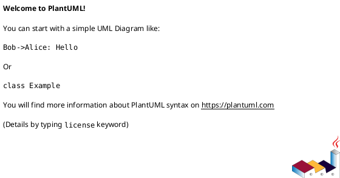
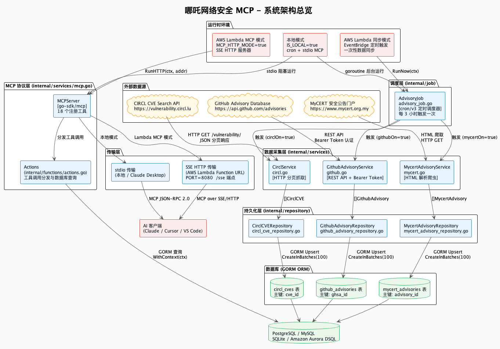
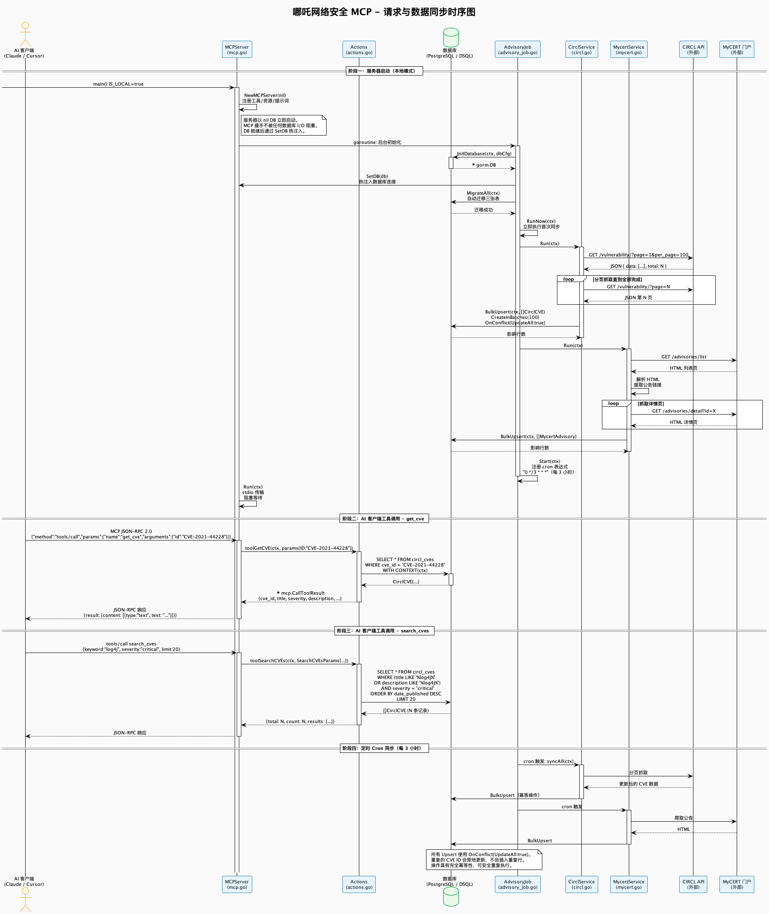

<div align="center">


# 哪吒网络安全 MCP

**生产级 Model Context Protocol (MCP) 服务器，专为 CVE 漏洞情报而生。**

聚合、存储并查询来自 CIRCL、MyCERT 和 GitHub Advisory Database 的安全公告，通过 MCP JSON-RPC 2.0 直接服务于你的 AI 助手。

[](https://go.dev)
[](https://github.com/modelcontextprotocol/go-sdk)
[](./LICENSE)
[](https://aws.amazon.com/lambda/)
[](https://gorm.io)

[English](./README.md) | [中文](#)

</div>

---

## 目录

- [项目概述](#项目概述)
- [系统架构](#系统架构)
- [数据来源](#数据来源)
- [MCP 工具参考](#mcp-工具参考)
- [数据模型](#数据模型)
- [安全设计](#安全设计)
- [运行时环境](#运行时环境)
- [快速开始](#快速开始)
- [配置参考](#配置参考)
- [构建与部署](#构建与部署)
- [数据库支持](#数据库支持)
- [渲染图表输出](#渲染图表输出)
- [项目结构](#项目结构)
- [开源许可证](#开源许可证)

---

## 项目概述

NezhaCyberMCP 是一个基于 Go 语言的 MCP 服务器，将 AI 助手（Claude、Cursor、VS Code Copilot）与持续更新的 CVE 漏洞数据库连接起来。它支持三种独立的运行时模式：

| 模式                | 触发方式             | 传输协议               | 适用场景                 |
| ------------------- | -------------------- | ---------------------- | ------------------------ |
| **本地模式**        | `IS_LOCAL=true`      | stdio (JSON-RPC 2.0)   | Claude Desktop、本地开发 |
| **Lambda 同步模式** | EventBridge 定时规则 | —                      | 仅执行定时数据采集       |
| **Lambda MCP 模式** | `MCP_HTTP_MODE=true` | SSE over HTTP (`/sse`) | 云端 MCP 端点            |

服务器注册了 **18 个 MCP 工具**，覆盖 CVE 查询、多维度搜索、CPE 匹配、严重程度过滤、趋势分析和厂商/产品统计。

---

## 系统架构

系统由六个独立层次组成，每层职责单一，仅与相邻层通信。

```
+---------------------------+
|       AI 客户端            |  Claude / Cursor / VS Code
|  (MCP JSON-RPC 2.0)       |
+---------------------------+
            |
            v
+---------------------------+
|       传输层               |  stdio（本地）| SSE HTTP（Lambda）
+---------------------------+
            |
            v
+---------------------------+
|    MCP 协议层              |  MCPServer + 18 个工具（mcp.go）
|    Actions 分发器          |  actions.go — 查询路由
+---------------------------+
            |
            v
+---------------------------+
|       持久化层             |  GORM 仓库（3 张表）
|    （Repository 模式）     |  Upsert、批量写入、查询
+---------------------------+
            |
            v
+---------------------------+
|        数据库              |  PostgreSQL / MySQL / SQLite
|                           |  Amazon Aurora DSQL（AWS）
+---------------------------+
            ^
            |
+---------------------------+
|   数据采集层 + 调度层       |  CirclService / GithubService
|                           |  MycertService + cron/v3
+---------------------------+
            ^
            |
+---------------------------+
|      外部数据源             |  CIRCL API / GitHub API
|                           |  MyCERT 门户（HTML 爬取）
+---------------------------+
```

### 架构图（PlantUML）

> 完整的 PlantUML 源文件位于 [`docs/zh/flow.puml`](./docs/zh/flow.puml)。
> 可使用 [PlantUML 在线渲染](https://www.plantuml.com/plantuml/uml/) 或 VS Code PlantUML 插件查看。



### 时序图（PlantUML）

> 完整的请求生命周期与数据同步时序见 [`docs/zh/sequence.puml`](./docs/zh/sequence.puml)。

**关键设计决策 — 非阻塞启动：**

`MCPServer` 以 `nil` 数据库连接构造并立即启动。MCP 协议握手（`initialize` → `initialized`）在任何数据库 I/O 开始之前完成。数据库连接在后台 goroutine 中建立，就绪后通过 `SetDB()` 热注入。这确保 AI 客户端在服务器启动期间不会遭遇连接超时。

```
main()
  |
  +-- NewMCPServer(nil)          <-- 立即启动，无需 DB
  |     registerTools()
  |     registerResources()
  |     registerPrompts()
  |
  +-- goroutine: BackgroundInit()
  |     InitDatabase(ctx, cfg)
  |     mcpServer.SetDB(db)      <-- DB 就绪后热注入
  |     MigrateAll(ctx)
  |     RunNow(ctx)              <-- 立即执行首次同步
  |     advisoryJob.Start(ctx)   <-- 启动 cron 调度器
  |
  +-- mcpServer.Run(ctx)         <-- 阻塞 stdio 循环
```

---

## 数据来源

### 1. CIRCL CVE Search API

- **端点：** `https://vulnerability.circl.lu/api/vulnerability/`
- **协议：** HTTP REST，JSON 分页（`page`、`per_page=100`）
- **认证：** 无需认证（公开 API）
- **数据：** 完整 CVE 记录，包含 CVSS 评分、CWE 编号、受影响软件包、参考链接
- **同步频率：** 每 3 小时一次（通过 cron 表达式配置）
- **限速：** 请求间隔 500ms（`RateLimit` 配置字段）
- **重试策略：** 最多 5 次重试，2 秒指数退避

**分页算法：**

```
page := 1
for {
    resp = GET /vulnerability/?page={page}&per_page=100
    if len(resp.Data) == 0 { break }
    BulkUpsert(resp.Data)
    page++
}
```

### 2. GitHub Advisory Database

- **端点：** `https://api.github.com/advisories`
- **协议：** GitHub REST API v3
- **认证：** Bearer Token（`GITHUB_TOKEN` 环境变量）
- **数据：** GHSA 记录，含 CVE 交叉引用、严重程度、受影响软件包（生态系统感知）
- **开关：** 由 `IsGithubAdvisoryTurnOn` 常量控制（当前为 `false`）

### 3. MyCERT 安全公告门户

- **来源：** `https://www.mycert.org.my`
- **协议：** HTML 爬取，使用 `golang.org/x/net/html`
- **认证：** 无需认证（公开门户）
- **数据：** 马来西亚计算机应急响应小组安全公告，含全文内容
- **详情抓取：** `FetchDetail=true` 时启用（抓取各公告详情页）
- **开关：** 由 `IsMycertAdvisoryTurnOn` 常量控制（当前为 `true`）

---

## MCP 工具参考

所有工具通过 MCP JSON-RPC 2.0 通信。工具输入由 `go-sdk/mcp` 库根据 JSON Schema 验证。所有响应均为结构化 JSON。

### 查询工具

| 工具名               | 描述                              | 关键参数                                                                         |
| -------------------- | --------------------------------- | -------------------------------------------------------------------------------- |
| `get_cve`            | 按 ID 查询单条 CVE 记录           | `id: string`（如 `CVE-2021-44228`）                                              |
| `search_cves`        | 多维度 CVE 搜索                   | `keyword`、`vendor`、`product`、`cwe`、`date_from`、`date_to`、`status`、`limit` |
| `search_by_cpe`      | 按 CPE 2.3 字符串搜索 CVE         | `cpe_string`（完整 CPE 或 `vendor:product` 片段）                                |
| `bulk_get`           | 批量查询最多 50 条 CVE            | `ids: []string`                                                                  |
| `filter_by_severity` | 按严重程度过滤                    | `severities: []string`、`date_from`、`date_to`、`limit`                          |
| `get_cwe`            | 提取 CVE 关联的 CWE 编号          | `id: string`                                                                     |
| `get_references`     | 提取 CVE 的参考链接               | `id: string`                                                                     |
| `related_cves`       | 查找共享分配机构或 CWE 的相关 CVE | `id: string`                                                                     |
| `whats_new`          | 查询指定日期后发布的新 CVE        | `since: string`、`min_severity: string`                                          |

### 分析工具

| 工具名                  | 描述                    | 关键参数                                                       |
| ----------------------- | ----------------------- | -------------------------------------------------------------- |
| `vuln_trends`           | 漏洞数量随时间变化趋势  | `group_by: day\|week\|month\|severity`、`date_from`、`date_to` |
| `top_vendors`           | 漏洞数量最多的厂商排行  | `date_from`、`date_to`、`limit`                                |
| `top_products`          | 漏洞数量最多的产品排行  | `vendor`、`date_from`、`date_to`、`limit`                      |
| `severity_distribution` | 各严重程度 CVE 数量分布 | `date_from`、`date_to`、`vendor`                               |

### 资产匹配工具

| 工具名            | 描述                      | 关键参数                                                                 |
| ----------------- | ------------------------- | ------------------------------------------------------------------------ |
| `match_inventory` | 将软件资产清单与 CVE 匹配 | `packages: []string`（`vendor:product[:version]`）、`cpe_list: []string` |

### 占位工具（尚未实现）

这些工具已注册，调用时返回明确的 `not implemented` 错误，为未来集成预留接口：

| 工具名           | 计划数据源                     |
| ---------------- | ------------------------------ |
| `get_kev_status` | CISA 已知被利用漏洞目录        |
| `get_epss`       | EPSS 漏洞利用预测评分系统      |
| `prioritize`     | CVSS + EPSS + KEV 综合评分排序 |
| `match_sbom`     | CycloneDX / SPDX SBOM 解析     |

---

## 数据模型

### `CirclCVE` — `circl_cves` 表

CVE 数据的主要来源，由 CIRCL Vulnerability-Lookup API 填充。

| 字段              | 类型              | 说明                                                                   |
| ----------------- | ----------------- | ---------------------------------------------------------------------- |
| `cve_id`          | `VARCHAR`（主键） | CVE 唯一标识符（如 `CVE-2021-44228`）                                  |
| `state`           | `VARCHAR`         | `PUBLISHED` \| `REJECTED` \| `RESERVED`                                |
| `assigner_org_id` | `VARCHAR`         | 分配机构组织 UUID                                                      |
| `assigner_short`  | `VARCHAR`         | 分配机构简称（如 `apache`）                                            |
| `title`           | `TEXT`            | 漏洞标题                                                               |
| `description`     | `TEXT`            | 完整描述                                                               |
| `severity`        | `VARCHAR`         | 归一化严重程度：`critical` \| `high` \| `medium` \| `low` \| `unknown` |
| `cwe_ids`         | `TEXT`（JSON）    | CWE 编号数组                                                           |
| `affected`        | `TEXT`（JSON）    | 受影响软件包数组                                                       |
| `references`      | `TEXT`（JSON）    | 参考链接数组                                                           |
| `date_published`  | `TIMESTAMP`       | 首次发布时间（可为空）                                                 |
| `date_updated`    | `TIMESTAMP`       | 最后更新时间（可为空）                                                 |
| `date_reserved`   | `TIMESTAMP`       | CVE ID 预留时间（可为空）                                              |
| `scraped_at`      | `TIMESTAMP`       | 最后采集时间（自动更新）                                               |

### `GithubAdvisory` — `github_advisories` 表

| 字段              | 类型              | 说明                                      |
| ----------------- | ----------------- | ----------------------------------------- |
| `ghsa_id`         | `VARCHAR`（主键） | GitHub Security Advisory ID               |
| `cve_id`          | `VARCHAR`         | 交叉引用的 CVE 编号（可为空）             |
| `summary`         | `VARCHAR`         | 单行摘要                                  |
| `description`     | `TEXT`            | 完整描述                                  |
| `severity`        | `VARCHAR`         | `low` \| `medium` \| `high` \| `critical` |
| `type`            | `VARCHAR`         | `reviewed` \| `unreviewed` \| `malware`   |
| `vulnerabilities` | `TEXT`（JSON）    | 受影响软件包（含生态系统信息）            |
| `published_at`    | `TIMESTAMP`       | 发布时间（可为空）                        |
| `withdrawn_at`    | `TIMESTAMP`       | 撤回时间（可为空）                        |

### `MycertAdvisory` — `mycert_advisories` 表

| 字段           | 类型              | 说明                                        |
| -------------- | ----------------- | ------------------------------------------- |
| `advisory_id`  | `VARCHAR`（主键） | MyCERT 公告 ID（来自 URL 参数）             |
| `title`        | `TEXT`            | 公告标题                                    |
| `category`     | `VARCHAR`         | 公告分类（如 `Advisory`、`Alert`）          |
| `summary`      | `TEXT`            | 公告摘要                                    |
| `detail_url`   | `VARCHAR`         | 公告详情页完整 URL                          |
| `full_content` | `TEXT`            | 详情页正文全文（`FetchDetail=true` 时填充） |
| `published_at` | `TIMESTAMP`       | 发布时间（可为空）                          |
| `scraped_at`   | `TIMESTAMP`       | 最后采集时间（自动更新）                    |

---

## 安全设计

### 认证与授权

**所有凭据均不硬编码。** 所有敏感值仅从环境变量读取：

| 密钥                  | 环境变量                | 是否必需                              |
| --------------------- | ----------------------- | ------------------------------------- |
| GitHub API Token      | `GITHUB_TOKEN`          | 仅当 `IsGithubAdvisoryTurnOn=true` 时 |
| 数据库密码            | `DB_PASSWORD`           | 始终必需                              |
| AWS Access Key ID     | `AWS_ACCESS_KEY_ID`     | 仅 AWS 环境                           |
| AWS Secret Access Key | `AWS_SECRET_ACCESS_KEY` | 仅 AWS 环境                           |

**AWS 凭证校验**（`utilities/aws.go`）：`IsRunInAWS()` 函数验证 `AWS_ACCESS_KEY_ID` 和 `AWS_SECRET_ACCESS_KEY` 不为空，且不包含占位符值（如由单一字符重复组成的字符串 `xxx`，或以 `multiple` 开头的字符串）。这防止了因配置错误导致的静默失败。

**AWS Lambda IAM：** 在 Lambda 运行时（`AWS_LAMBDA_RUNTIME_API` 存在时），凭证由 IAM 执行角色自动注入，无需也不使用静态凭证。

### 数据保护

- **不存储 PII：** 数据库仅包含来自公开来源的 CVE 数据，不持久化任何用户数据、会话令牌或个人信息。
- **上下文传播：** 所有数据库查询使用 `WithContext(ctx)`，确保请求取消和超时信号正确传播到数据库驱动，防止 goroutine 泄漏和失控查询。
- **幂等写入：** 所有采集操作使用 `OnConflict{UpdateAll: true}` 配合 `CreateInBatches(100)` 包裹在数据库事务中，保证原子性，防止部分写入。

### 输入验证

- MCP 工具参数在到达 `Actions` 之前，由 `go-sdk/mcp` 库根据 JSON Schema 验证。
- SQL 注入由 GORM 的参数化查询构建器防止，从不通过字符串拼接构造原始 SQL。
- CVE ID 格式不在应用层验证——数据库主键约束强制唯一性。

### 传输安全

- **stdio 模式：** 通信通过本地进程管道，无网络暴露。
- **SSE HTTP 模式：** 服务器监听 `localhost:PORT`。在 Lambda 中，AWS 在 Function URL 层处理 TLS 终止，内部 HTTP 服务器从不直接暴露于互联网。

### 日志规范

通过 `utilities/logger.go` 进行结构化日志记录。日志级别：`DEBUG`、`INFO`、`WARN`、`ERROR`、`VERBOSE`。敏感值（凭证、令牌）在写入日志前通过 `utilities.Mask()` 脱敏。`LOG_LEVEL` 环境变量控制日志详细程度。

---

## 运行时环境

### 本地模式

```
IS_LOCAL=true
```

启动一个长驻进程：

1. 后台 goroutine：DB 初始化 → 迁移 → 立即同步 → cron 调度器
2. 前台：MCP stdio 服务器（阻塞）

DB 在连接建立后热注入到 MCP 服务器。DB 就绪前的工具调用返回明确错误信息，而非 panic。

### AWS Lambda — 同步模式（默认）

由 EventBridge 定时规则触发。执行一次完整的同步周期（迁移 + 抓取所有数据源）后退出，不启动 MCP 服务器。

```
# EventBridge 规则示例
rate(3 hours)
```

### AWS Lambda — MCP HTTP 模式

```
MCP_HTTP_MODE=true
PORT=8080
```

启动 SSE HTTP 服务器。AWS Lambda Function URL 将 HTTPS 请求代理到 `localhost:8080`。`/sse` 端点提供 MCP SSE 传输。不启动 cron 调度器——数据由同步 Lambda 写入。

---

## 快速开始

### 前置条件

- Go 1.26.1+
- 运行中的 PostgreSQL 实例（本地测试可使用 SQLite）
- `make`（可选，用于便捷构建目标）

### 1. 克隆并配置

```bash
git clone https://github.com/ctkqiang/NezhaCyberMCP.git
cd NezhaCyberMCP
cp .env.example .env   # 填写你的数据库凭证
```

### 2. 配置 `.env`

```dotenv
# 运行时模式
IS_LOCAL=true

# 数据库（PostgreSQL 示例）
DB_HOST=localhost
DB_PORT=5432
DB_USER=postgres
DB_PASSWORD=your_password
DB_NAME=nezha_cyber
DB_TIMEZONE=Asia/Shanghai

# 可选：GitHub Advisory 同步
GITHUB_TOKEN=ghp_xxxxxxxxxxxx

# 日志
LOG_LEVEL=INFO
```

### 3. 构建并运行

```bash
make build
./advisory
```

或直接运行：

```bash
go run .
```

### 4. 使用 MCP Inspector 调试

```bash
make run
# 等价于：npx @modelcontextprotocol/inspector ./advisory
```

### 5. 配置 Claude Desktop

添加到 `~/Library/Application Support/Claude/claude_desktop_config.json`：

```json
{
  "mcpServers": {
    "nezha-cyber": {
      "command": "/absolute/path/to/advisory",
      "env": {
        "IS_LOCAL": "true",
        "DB_HOST": "localhost",
        "DB_PORT": "5432",
        "DB_USER": "postgres",
        "DB_PASSWORD": "your_password",
        "DB_NAME": "nezha_cyber"
      }
    }
  }
}
```

---

## 配置参考

### 环境变量

| 变量                    | 默认值           | 说明                                                              |
| ----------------------- | ---------------- | ----------------------------------------------------------------- |
| `IS_LOCAL`              | `false`          | 设为 `true` 以本地模式运行（cron + stdio MCP）                    |
| `MCP_HTTP_MODE`         | `false`          | 设为 `true` 以运行 SSE HTTP 服务器（Lambda MCP 模式）             |
| `IS_AWS`                | `false`          | 设为 `true` 以使用 Amazon Aurora DSQL                             |
| `DB_HOST`               | —                | 数据库主机                                                        |
| `DB_PORT`               | `5432`           | 数据库端口                                                        |
| `DB_USER`               | —                | 数据库用户名                                                      |
| `DB_PASSWORD`           | —                | 数据库密码                                                        |
| `DB_NAME`               | —                | 数据库名称                                                        |
| `DB_TIMEZONE`           | `Asia/Shanghai`  | cron 调度器的 IANA 时区                                           |
| `GITHUB_TOKEN`          | —                | GitHub 个人访问令牌（用于 GitHub Advisory 同步）                  |
| `AWS_REGION`            | `ap-southeast-1` | AWS 区域（Aurora DSQL）                                           |
| `AWS_ACCESS_KEY_ID`     | —                | AWS 访问密钥（非 Lambda 环境）                                    |
| `AWS_SECRET_ACCESS_KEY` | —                | AWS 密钥（非 Lambda 环境）                                        |
| `PORT`                  | `8080`           | SSE 模式的 HTTP 端口                                              |
| `LOG_LEVEL`             | `INFO`           | 日志详细程度：`DEBUG` \| `INFO` \| `WARN` \| `ERROR` \| `VERBOSE` |

### 爬虫配置（`main.go` 中）

```go
scraperCfg := &services.AdvisoryScraperConfig{
    MaxPages:       0,              // 0 = 抓取所有页
    RequestTimeout: 30 * time.Second,
    PerPage:        100,            // 每页最大条目数
    RetryMax:       5,              // 最大重试次数
    RetryBackoff:   2 * time.Second,
    Token:          getEnv("GITHUB_TOKEN", ""),
}

circlCfg := &services.CirclScraperConfig{
    RequestTimeout: 30 * time.Second,
    RetryMax:       5,
    RetryBackoff:   2 * time.Second,
    RateLimit:      500 * time.Millisecond, // 请求间隔
}
```

### 数据源开关（`main.go` 中）

```go
const (
    IsGithubAdvisoryTurnOn = false  // GitHub Advisory 同步
    IsMycertAdvisoryTurnOn = true   // MyCERT 公告同步
    IsCirclCVETurnOn       = true   // CIRCL CVE 同步
)
```

---

## 构建与部署

### 本地二进制

```bash
make build
# 输出：./advisory
```

### AWS Lambda — x86_64

```bash
make lambda
# 输出：bootstrap.zip（可直接部署到 Lambda）
```

### AWS Lambda — arm64（Graviton2，成本更低）

```bash
make lambda-arm64
# 输出：bootstrap-arm64.zip
```

### 运行测试

```bash
make test
# 等价于：go test ./test/... -v -count=1
```

### 代码检查

```bash
make lint
# 需要安装：golangci-lint
```

---

## 数据库支持

NezhaCyberMCP 通过 GORM 驱动支持四种数据库后端：

| 数据库             | 驱动                              | 说明                   |
| ------------------ | --------------------------------- | ---------------------- |
| PostgreSQL         | `gorm.io/driver/postgres`         | 推荐用于生产环境       |
| MySQL              | `gorm.io/driver/mysql`            | 支持                   |
| SQLite             | `gorm.io/driver/sqlite`           | 适合本地开发           |
| Amazon Aurora DSQL | `aws-sdk-go-v2/feature/dsql/auth` | AWS 生产环境，IAM 认证 |

**Schema 迁移**由 GORM `AutoMigrate` 在每次启动时自动处理，迁移操作是幂等的——多次执行是安全的。

**批量写入策略：**

```go
// 所有批量写入使用此模式：
err := r.db.WithContext(ctx).Transaction(func(tx *gorm.DB) error {
    return tx.Clauses(clause.OnConflict{UpdateAll: true}).
        CreateInBatches(items, 100).Error
})
```

这保证了：

- **原子性：** 每批次全部成功或全部回滚
- **幂等性：** 已存在的记录原地更新，不产生重复行
- **性能：** 100 行批次减少数据库往返开销

---

## 渲染图表输出

`out/` 目录存放所有 PlantUML 图表的预渲染 PNG 导出文件。这些图片由 `docs/` 目录中的 `.puml` 源文件自动生成，可直接嵌入文档、Wiki 或演示文稿，无需在本地安装 PlantUML。

### 目录结构

```
out/
└── docs/
    ├── en/
    │   ├── flow/
    │   │   └── NezhaCyberMCP_Architecture.png   # 英文系统架构图
    │   └── sequence/
    │       └── NezhaCyberMCP_Sequence.png        # 英文请求与数据同步时序图
    └── zh/
        ├── flow/
        │   └── NezhaCyberMCP_架构图.png           # 中文系统架构图
        └── sequence/
            └── NezhaCyberMCP_时序图.png           # 中文请求与数据同步时序图
```

### 文件说明

| 文件                                              | 源文件                  | 内容说明                                                                                         |
| ------------------------------------------------- | ----------------------- | ------------------------------------------------------------------------------------------------ |
| `out/docs/en/flow/NezhaCyberMCP_Architecture.png` | `docs/en/flow.puml`     | 完整六层系统架构：外部数据源、采集服务、调度层、仓库层、数据库、MCP 协议层、传输层与 AI 客户端   |
| `out/docs/en/sequence/NezhaCyberMCP_Sequence.png` | `docs/en/sequence.puml` | 四阶段时序图：非阻塞启动与 DB 热注入、`get_cve` 工具调用、`search_cves` 工具调用、定时 cron 同步 |
| `out/docs/zh/flow/NezhaCyberMCP_架构图.png`       | `docs/zh/flow.puml`     | 架构图的中文版本                                                                                 |
| `out/docs/zh/sequence/NezhaCyberMCP_时序图.png`   | `docs/zh/sequence.puml` | 时序图的中文版本                                                                                 |

### 系统架构图



### 请求与数据同步时序图



### 命名规则

输出文件名由每个 `.puml` 源文件顶部的 `@startuml <图表名称>` 声明决定：

- `@startuml NezhaCyberMCP_Architecture` → `NezhaCyberMCP_Architecture.png`
- `@startuml NezhaCyberMCP_Sequence` → `NezhaCyberMCP_Sequence.png`
- `@startuml NezhaCyberMCP_架构图` → `NezhaCyberMCP_架构图.png`
- `@startuml NezhaCyberMCP_时序图` → `NezhaCyberMCP_时序图.png`

### 重新生成图表

如需从 `.puml` 源文件重新生成所有 PNG，请对 `docs/` 目录运行 PlantUML，并将输出路径指定为 `out/docs/`：

```bash
# 需要 Java 和 PlantUML jar，或 plantuml CLI
plantuml -tpng -o ../../out/docs/en/flow/     docs/en/flow.puml
plantuml -tpng -o ../../out/docs/en/sequence/ docs/en/sequence.puml
plantuml -tpng -o ../../out/docs/zh/flow/     docs/zh/flow.puml
plantuml -tpng -o ../../out/docs/zh/sequence/ docs/zh/sequence.puml
```

也可使用 VS Code PlantUML 插件（`Alt+D` 预览，`Ctrl+Shift+P` → `PlantUML: Export Current File Diagrams`），并将导出目录设置为 `out/`。

> **说明：** `out/` 目录已纳入版本控制，确保渲染后的图表可在 GitHub 上直接查看，无需任何本地工具。

---

## 项目结构

```
NezhaCyberMCP/
├── main.go                          # 入口，运行时模式选择
├── go.mod                           # Go 模块定义
├── Makefile                         # 构建、测试、检查、Lambda 打包
├── docs/
│   ├── en/
│   │   ├── flow.puml                # 系统架构图源文件（英文）
│   │   └── sequence.puml            # 请求/同步时序图源文件（英文）
│   └── zh/
│       ├── flow.puml                # 系统架构图源文件（中文）
│       └── sequence.puml            # 请求/同步时序图源文件（中文）
├── out/
│   └── docs/
│       ├── en/
│       │   ├── flow/
│       │   │   └── NezhaCyberMCP_Architecture.png   # 渲染后架构图（英文）
│       │   └── sequence/
│       │       └── NezhaCyberMCP_Sequence.png        # 渲染后时序图（英文）
│       └── zh/
│           ├── flow/
│           │   └── NezhaCyberMCP_架构图.png           # 渲染后架构图（中文）
│           └── sequence/
│               └── NezhaCyberMCP_时序图.png           # 渲染后时序图（中文）
├── internal/
│   ├── functions/
│   │   └── actions.go               # MCP 工具实现与数据库查询逻辑
│   ├── job/
│   │   └── advisory_job.go          # cron 调度器、迁移、同步编排
│   ├── model/
│   │   ├── circl_cve.go             # CirclCVE GORM 模型
│   │   ├── github_advisory.go       # GithubAdvisory GORM 模型
│   │   └── mycert_advisory.go       # MycertAdvisory GORM 模型
│   ├── repository/
│   │   ├── circl_cve_repository.go
│   │   ├── github_advisory_repository.go
│   │   └── mycert_advisory_repository.go
│   ├── services/
│   │   ├── circl.go                 # CIRCL API 客户端与爬虫
│   │   ├── database.go              # 数据库连接工厂
│   │   ├── github.go                # GitHub Advisory API 客户端
│   │   ├── mcp.go                   # MCPServer：工具/资源/提示词注册
│   │   └── mycert.go                # MyCERT HTML 爬虫
│   └── utilities/
│       ├── aws.go                   # AWS 环境检测与凭证校验
│       └── logger.go                # 结构化日志（LogStart/Progress/Success/Error/Warn）
├── test/
│   ├── aws_test.go
│   ├── circl_cve_test.go
│   ├── database_dsql_test.go
│   ├── db_environment_test.go
│   ├── github_advisory_repository_test.go
│   ├── mycert_repository_test.go
│   └── mycert_scraper_test.go
└── landing/                         # Vue/Nuxt 落地页（独立部署）
```

---

## 开源许可证

```
MIT License

Copyright (c) 2026 ctkqiang

Permission is hereby granted, free of charge, to any person obtaining a copy
of this software and associated documentation files (the "Software"), to deal
in the Software without restriction, including without limitation the rights
to use, copy, modify, merge, publish, distribute, sublicense, and/or sell
copies of the Software, and to permit persons to whom the Software is
furnished to do so, subject to the following conditions:

The above copyright notice and this permission notice shall be included in all
copies or substantial portions of the Software.

THE SOFTWARE IS PROVIDED "AS IS", WITHOUT WARRANTY OF ANY KIND, EXPRESS OR
IMPLIED, INCLUDING BUT NOT LIMITED TO THE WARRANTIES OF MERCHANTABILITY,
FITNESS FOR A PARTICULAR PURPOSE AND NONINFRINGEMENT. IN NO EVENT SHALL THE
AUTHORS OR COPYRIGHT HOLDERS BE LIABLE FOR ANY CLAIM, DAMAGES OR OTHER
LIABILITY, WHETHER IN AN ACTION OF CONTRACT, TORT OR OTHERWISE, ARISING FROM,
OUT OF OR IN CONNECTION WITH THE SOFTWARE OR THE USE OR OTHER DEALINGS IN THE
SOFTWARE.
```

---

<div align="center">

基于 Go 构建 · 由 MCP 驱动 · 安全设计 · ctkqiang

</div>
